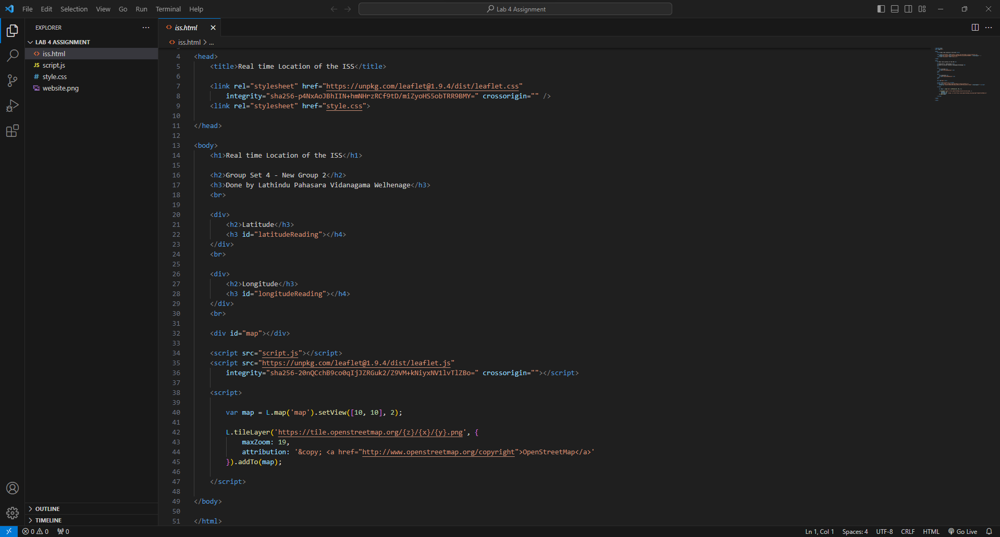

# Real-time Location of the ISS


## Group Set 4 - New Group 2

### Project Overview

This GitHub repository contains the code and resources for the "Real-time Location of the ISS" project, developed by Group Set 4 - New Group 2 during the second semester of Module: 24W Mobile APIs and Frameworks - 01.

### Done by

- **Lathindu Pahasara Vidanagama Welhenage**

### Project Description

This project is focused on tracking the real-time location of the International Space Station (ISS). The ISS coordinates are obtained using the [Where the ISS at?](https://wheretheiss.at/) API. The location data is displayed on a web page, allowing users to stay updated on the ISS's current latitude and longitude.

### Website Preview


### Code Snippets

#### HTML Structure


#### JavaScript Logic


#### JavaScript Code
```javascript
const API_URL = "https://api.wheretheiss.at/v1/satellites/25544";

async function updateISSLocation() {
    try {
        const response = await fetch(API_URL);
        const { latitude, longitude } = await response.json();

        document.getElementById('latitudeReading').textContent = latitude;
        document.getElementById('longitudeReading').textContent = longitude;

        const [lat, lon] = [parseFloat(latitude), parseFloat(longitude)];

        map.setView([lat, lon], 5);

        const issMarker = L.marker([lat, lon]).addTo(map);
        issMarker.openPopup();
    } catch (error) {
        console.error("Error getting location:", error);
    }
}

// Initial call to update ISS location
updateISSLocation();
```
